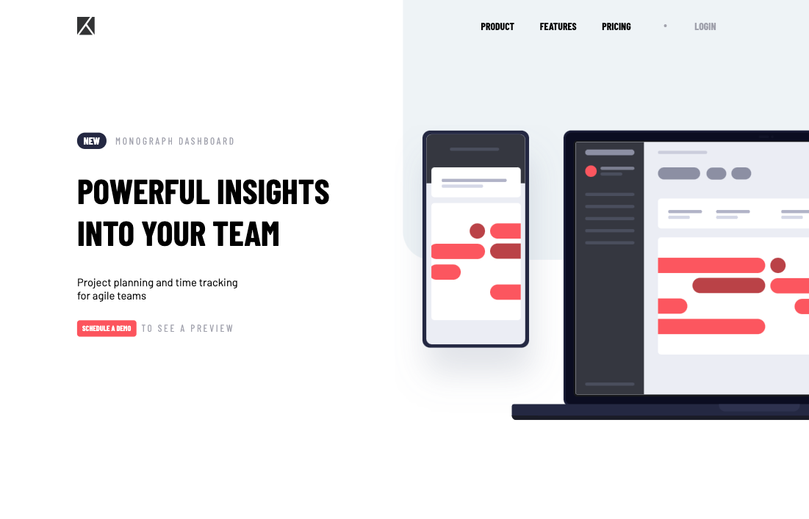

# Frontend Mentor - Project tracking intro component solution

This is a solution to the [Project tracking intro component challenge on Frontend Mentor](https://www.frontendmentor.io/challenges/project-tracking-intro-component-5d289097500fcb331a67d80e). Frontend Mentor challenges help you improve your coding skills by building realistic projects.

## Table of contents

- [Overview](#overview)
  - [The challenge](#the-challenge)
  - [Screenshot](#screenshot)
  - [Links](#links)
- [My process](#my-process)
  - [Built with](#built-with)
  - [What I learned](#what-i-learned)
  - [Continued development](#continued-development)
  - [Useful resources](#useful-resources)
- [Author](#author)
- [Acknowledgments](#acknowledgments)

**Note: Delete this note and update the table of contents based on what sections you keep.**

## Overview

### The challenge

Users should be able to:

- View the optimal layout for the site depending on their device's screen size
- See hover states for all interactive elements on the page
- Create the background shape using code

### Screenshot

### Links

- [Github Repository](https://github.com/Barbelitos/FrontEndMentor-ProjectTrackingComponent)
- [Live Site](https://barbelitos.github.io/FrontEndMentor-ProjectTrackingComponent/)

## My process

### Built with

- HTML5
- CSS
- Flexbox
- JavaScript
- Mobile-first workflow

### What I learned

This challenge was a good practice of flexbox, both in navigation and main containers. Also had to do some research about how to properly hide overflow content in the page.

### Continued development

Continuing to improve my CSS skills, especially flexbox.

### Useful resources

## Author

- Github - [@Barbelitos](https://github.com/Barbelitos)
- Frontend Mentor - [@Barbelitos](https://www.frontendmentor.io/profile/Barbelitos)

## Acknowledgments
